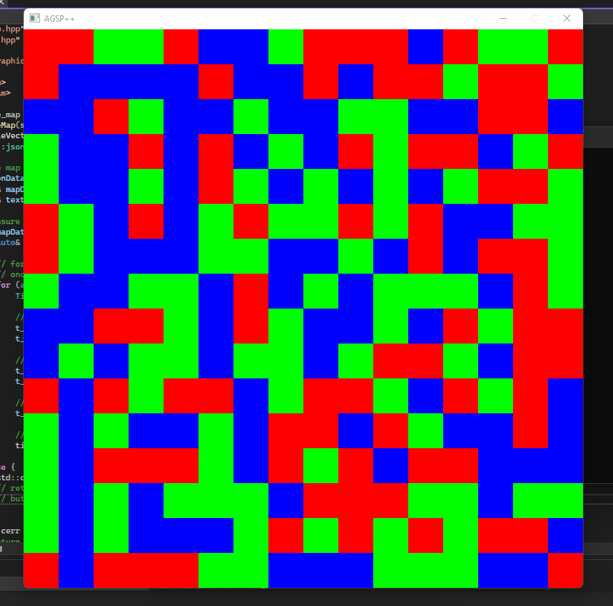

# AGSP (Another Generic SFML Project)
AGSP is...

---

## == to-implement ==
- [ ] error handling pipeline to account for areas in program execution scope
- [x] 16x16 grid
- [ ] editor for map creation (~~for now create script for generating test data~~ (done))
- [ ] state system
- [ ] menu system (in-game, pause, main menu)
- [ ] multi-layered world/map
- [ ] better manifest checking (for data)
- [ ] encapsulating game class (?)
- [ ] separate asset data into subdirectorys (map data in map data, fonts in fonts, etc)

## == preview ==

